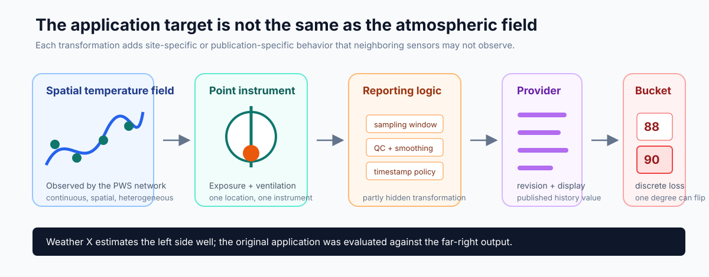
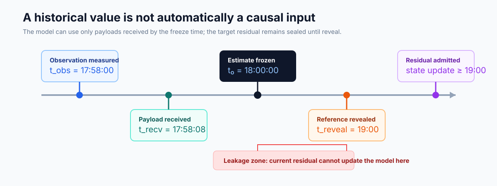
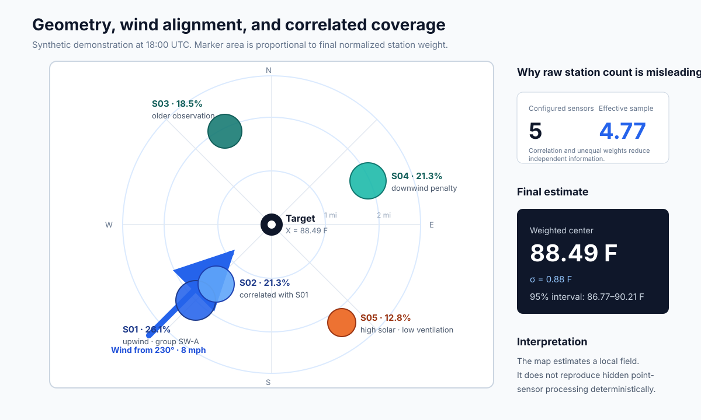
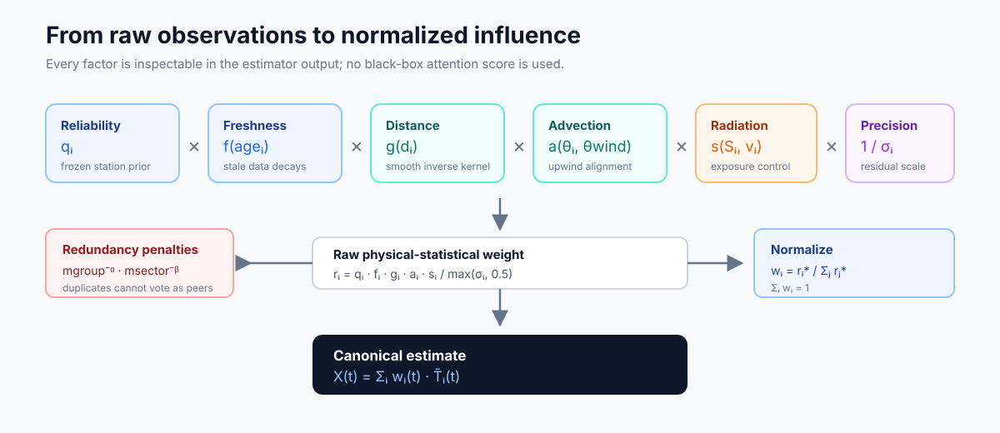
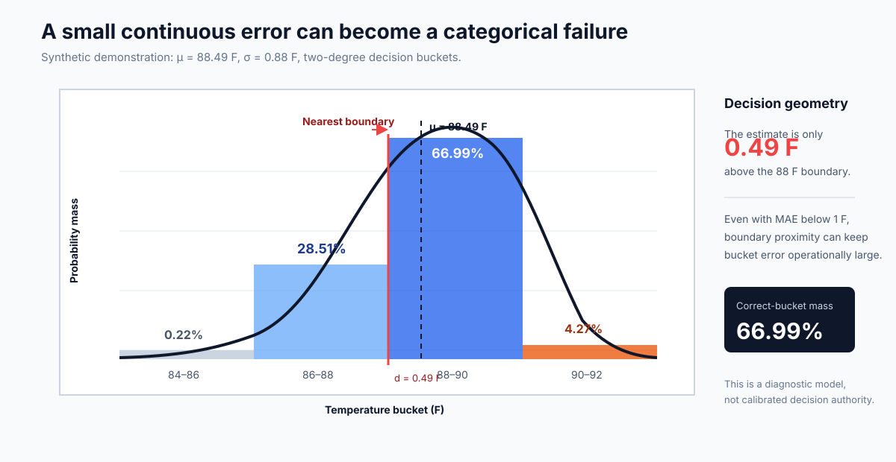
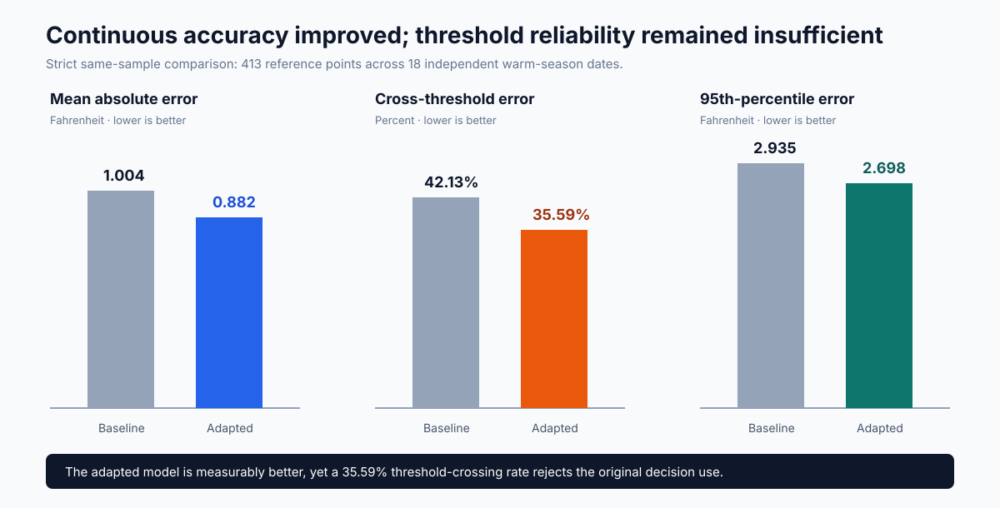

# Weather X: Causal Reconstruction of Local Temperature from a Dense Personal Weather Station Network

**An open-source technical research note on spatial weighting, observation-time causality,
point-sensor mismatch, uncertainty, and threshold-sensitive validation**

> Status: engineering research note, not a peer-reviewed meteorological paper.
> Scope: one anonymized reference-location case study, 18 independent warm-season dates, and
> synthetic public examples.
> Result: continuous error improved; exact threshold reliability remained insufficient for the
> original application.

## Abstract

Weather X began as an attempt to infer the next temperature published for a public reference
location from a dense ring of nearby personal weather stations (PWS). The original hypothesis was
that a spatially balanced network, corrected for elevation, station bias, freshness, wind
advection, solar exposure, and correlated neighbors, could estimate the target earlier than a
downstream public history page. The engineering problem appeared to be local weather prediction.
Data-lineage analysis showed that the true application target was narrower: the discretized output
of one point instrument after unknown sampling, smoothing, quality-control, revision, and display
transformations.

This article defines the estimator mathematically, proves several useful properties of its
weighting and causal-availability rules, and separates continuous reconstruction from categorical
threshold accuracy. In a frozen strict comparison containing 413 reference points across 18
independent warm-season dates, a supervised adaptation reduced mean absolute error from 1.004 F to
0.882 F and reduced the 95th-percentile absolute error from 2.935 F to 2.698 F. However, the
two-degree cross-threshold error remained 35.59%. The result supports a limited scientific claim:
dense quality-controlled PWS networks can improve an estimate of a local temperature field, but
they do not necessarily reproduce the exact discrete output of a specific reference instrument.

**Keywords:** personal weather stations, sensor fusion, spatial interpolation, microclimate,
causal evaluation, delayed labels, uncertainty, threshold loss, negative results



*Figure 1 — Weather X observes the surrounding atmospheric field. The original application was
evaluated against the far-right output of a longer, partly hidden reporting chain.*

## 1. The first scientific decision: define the estimand

Let (T(mathbf{s},t)) denote the near-surface air-temperature field at location
(mathbf{s}) and time (t). A network of (n) personal weather stations observes noisy samples

$$
Z_i(t_i) = T(\mathbf{s}_i,t_i) + b_i(t_i) + \epsilon_i(t_i),
\qquad i=1,\ldots,n,
$$

where (b_i) represents systematic exposure or calibration bias and (epsilon_i) represents
short-lived sensor noise.

The intuitive objective is to estimate the physical field at the target coordinate
(mathbf{s}_0):

$$
X_t \approx T(\mathbf{s}_0,t).
$$

The published reference value is not necessarily (T(mathbf{s}_0,t)). A more realistic
observation equation is

$$
Y_t = \mathcal{D}\!\left(
\mathcal{P}\!\left[
\mathcal{Q}\!\left(
\mathcal{M}\!\left(T(\mathbf{s}_0,\tau),\; \tau \in W_t\right)
\right)\right]\right]
+ \eta_t,
$$

where:

- (mathcal{M}) is the instrument's sampling or temporal aggregation over an unknown window
  (W_t);
- (mathcal{Q}) is station-level quality control;
- (mathcal{P}) is provider-side publication and revision logic;
- (mathcal{D}) is the final display or discretization transform;
- (eta_t) contains site, instrument, and reporting behavior not observed by the neighboring
  network.

The difference

$$
\Delta_t = Y_t - T(\mathbf{s}_0,t)
$$

is not ordinary forecast noise. It is an **estimand mismatch**. Improving the spatial estimate
(X_t) can reduce (|X_t-T(mathbf{s}_0,t)|) without eliminating
(|X_t-Y_t|).

This distinction is consistent with the broader PWS literature: dense citizen networks can reveal
high-resolution urban patterns, but exposure, metadata, siting, and quality control are central
limitations [1–3]. Professional observing guidance likewise treats instrument exposure,
calibration, and measurement method as part of the observation definition [4].

## 2. Notation and causal information set

For station (i) and target generation time (t_0), define:

| Symbol | Meaning |
|---|---|
| (mathbf{s}_0,z_0) | target coordinate and elevation |
| (mathbf{s}_i,z_i) | station coordinate and elevation |
| (Z_i) | latest admissible station temperature |
| (t_i^{obs}) | physical observation time |
| (t_i^{recv}) | first time the system received that payload |
| (d_i,	heta_i) | distance and bearing from target to station |
| (q_i) | frozen station reliability prior |
| (sigma_i) | frozen historical residual scale |
| (b_i) | frozen station bias relative to target |
| (w_i(t_0)) | final normalized station weight |
| (X(t_0)) | canonical Weather X estimate |
| (t^{reveal}) | time at which a reference label becomes admissible for learning |

The admissible observation set is

$$
\mathcal{A}(t_0)=\left\{
i:\; t_i^{obs}\le t_0,\; t_i^{recv}\le t_0,\;
t_0-t_i^{obs}\le A_{max},\; QC_i=1
\right\}.
$$

For strict causal research, a missing receipt time is **unknown**, not evidence that the payload
was available. The public file interface permits a missing `received_at` for demonstrations, but
formal evaluation must either capture it prospectively or exclude that record from a latency
claim.

Let the model state at (t_0) be

$$
\mathcal{M}(t_0)=\operatorname{Train}
\left(\left\{(X_j,Y_j):t_j^{reveal}\le t_0\right\}\right).
$$

The prediction is then a deterministic function

$$
X(t_0)=F\big(\mathcal{A}(t_0),\mathcal{M}(t_0)\big).
$$

### Proposition 1 — Causal admissibility

If every input to (F) satisfies (t_i^{recv}\le t_0), and every label used to construct
(mathcal{M}(t_0)) satisfies (t_j^{reveal}\le t_0), then (X(t_0)) is measurable with respect
to the system information available by (t_0). No later payload revision or current-target label
can influence the frozen estimate.

**Proof.** By construction, (mathcal{A}(t_0)) contains only payloads received by (t_0).
Similarly, (mathcal{M}(t_0)) is a function only of labels revealed by (t_0). A deterministic
composition of quantities available in the information set (mathcal{F}_{t_0}) is itself
(mathcal{F}_{t_0})-measurable. Therefore (F(mathcal{A}(t_0),mathcal{M}(t_0))) cannot depend on
future information. (square)



*Figure 2 — Measurement time, receipt time, freeze time, and reveal time are different events. A
historical database that preserves only measurement time cannot prove real-time availability.*

## 3. Spatial geometry

The target-to-station great-circle distance is computed with the haversine equation:

$$
d_i = 2R\arcsin\sqrt{
\sin^2\left(\frac{\phi_i-\phi_0}{2}\right)
+\cos\phi_0\cos\phi_i
\sin^2\left(\frac{\lambda_i-\lambda_0}{2}\right)},
$$

where (phi) and (lambda) are latitude and longitude in radians. The initial bearing is

$$
\theta_i = \operatorname{atan2}
\left(
\sin\Delta\lambda\cos\phi_i,
\cos\phi_0\sin\phi_i-
\sin\phi_0\cos\phi_i\cos\Delta\lambda
\right).
$$

Distance alone is not enough. Two nearby stations on the same block may be less informative than
two slightly farther stations that observe different directional sectors. Weather X therefore
retains both continuous distance and discrete sector identity.



*Figure 3 — A synthetic five-station network. Marker area represents final influence after
reliability, freshness, distance, wind, radiation, residual scale, correlation, and sector
adjustments.*

## 4. Target-equivalent station temperature

Let (gamma) be the configurable positive lapse-rate magnitude in degrees Fahrenheit per 1,000
feet. A station above the target is adjusted warmer when translated down to target elevation:

$$
\widetilde{T}_i(t_0)
= Z_i(t_i^{obs})
+ \gamma\frac{z_i-z_0}{1000}
- b_i.
$$

The correction is deliberately explicit. It is a testable modeling assumption, not a universal
law. Under strong surface heating, stable nocturnal layers, drainage flows, or urban canopy
effects, a fixed free-air lapse rate may be locally wrong.

The station bias can be estimated from earlier revealed residuals. A robust fixed form is

$$
\widehat b_i =
\operatorname{median}_{t\in\mathcal{H}_{train}}
\left[
Z_i(t)+\gamma\frac{z_i-z_0}{1000}-Y_t
\right].
$$

The public reference implementation accepts a frozen (b_i) and residual scale (sigma_i). In
the broader research audit, the residual was decomposed conceptually as

$$
r_{i,t}
= \beta_{0,i}
+ f_h(h_t)
+ f_S(S_{i,t})
+ \beta_v v_t\cos(\theta_i-\theta_t^{wind})
+ f_{lag}(\Delta T_t)
+ f_{season}(DOY_t)
+ \xi_{i,t},
$$

where the terms represent fixed station bias, hour-of-day exposure, solar response, wind-aligned
advection, warming/cooling lag, seasonal behavior, and unresolved local randomness. This equation
is valuable even when not all terms are promoted into the runtime estimator: it turns vague
"station quality" into falsifiable residual hypotheses.

To prevent overfitting, any fitted effect must use only past revealed dates and should be
regularized, for example:

$$
\widehat{\boldsymbol\beta}
=\arg\min_{\boldsymbol\beta}
\sum_{t\in\mathcal{H}_{train}}
\rho_\delta\!\left(r_{i,t}-\mathbf{x}_{i,t}^{\top}\boldsymbol\beta\right)
+\lambda\lVert\boldsymbol\beta\rVert_2^2,
$$

with Huber loss (
ho_delta), ridge penalty (lambda), and validation grouped by date rather
than randomly split snapshots.

## 5. Multiplicative station weights

Weather X avoids a single opaque score. The raw influence is a product of interpretable factors.

### 5.1 Freshness

With observation age (a_i=t_0-t_i^{obs}) and maximum age (A_{max}), the public estimator uses

$$
f_i^{fresh}=\max\left(0.15,\;1-\frac{a_i}{A_{max}}\right),
\qquad 0\le a_i\le A_{max}.
$$

Records older than (A_{max}) are excluded. The 0.15 floor prevents a still-admissible station
from disappearing discontinuously just before the cutoff.

### 5.2 Distance kernel

For configurable spatial scale (ell>0),

$$
f_i^{dist}=\frac{1}{1+d_i/\ell}.
$$

This kernel is bounded, monotone, and less singular than (1/d_i^p) near the target.

### 5.3 Wind-aligned advection

Let (	heta^{wind}) be the meteorological direction **from** which the wind originates. Define

$$
c_i=\cos\left(\theta_i-\theta^{wind}\right).
$$

When wind speed is at least 3 mph, the current bounded factor is

$$
f_i^{wind}
=\operatorname{clip}_{[0.55,1.35]}\left(1+0.30c_i\right).
$$

An aligned upwind station has (c_i\approx1); a downwind station has (c_i\approx-1). Below the
wind-speed gate, (f_i^{wind}=1).

### 5.4 Radiation and ventilation

The public estimator uses a transparent piecewise diagnostic:

$$
f_i^{solar}=
\begin{cases}
0.88, & S_i\ge750\ \text{W m}^{-2},\ v_i<4\ \text{mph},\\
0.96, & S_i\ge750\ \text{W m}^{-2},\ v_i\ge4\ \text{mph},\\
0.94, & S_i\le250\ \text{W m}^{-2},\\
1.00, & \text{otherwise}.
\end{cases}
$$

This does not claim to solve radiation error physically. It encodes the limited statement that a
high-radiation, poorly ventilated household sensor deserves less influence.

### 5.5 Reliability and residual precision

Let (q_i\in[0,1]) be a frozen reliability prior and let (sigma_i) be a historical residual
scale. The raw station weight is

$$
r_i=
\frac{
q_i f_i^{fresh} f_i^{dist} f_i^{wind} f_i^{solar}
}{\max(0.5,\sigma_i)}.
$$

### 5.6 Correlation-group and sector penalties

If (m_{g(i)}) usable sensors share station (i)'s correlation group and (m_{s(i)}) usable
sensors share its directional sector, then

$$
r_i^*=r_i\cdot m_{g(i)}^{-\alpha}\cdot m_{s(i)}^{-\beta},
$$

where the demonstration configuration uses (alpha=0.5) and (eta=0.35). The normalized weight
is

$$
w_i=\frac{r_i^*}{\sum_{j\in\mathcal{A}(t_0)}r_j^*},
\qquad
w_i\ge0,
\qquad
\sum_i w_i=1.
$$



*Figure 4 — Each final station weight has a complete factorization that can be inspected,
replayed, and challenged.*

### Proposition 2 — Duplicate-group growth is sublinear

Assume (m) otherwise identical stations in one correlation group, each with unpenalized weight
(r), and ignore the sector penalty. Their total adjusted group mass is

$$
R_g(m)=\sum_{i=1}^{m}r m^{-\alpha}=r m^{1-\alpha}.
$$

For (0<\alpha<1), group influence grows sublinearly. With (alpha=0.5), doubling identical
sensors multiplies their group mass by (sqrt{2}), not by 2. With (alpha=1), total group mass is
exactly capped at (r).

**Proof.** Every member receives multiplier (m^{-\alpha}). Summing (m) equal terms gives
(mrm^{-\alpha}=rm^{1-\alpha}). Since (1-\alpha\in(0,1)), the function is concave and sublinear.
(square)

This penalty is soft: it reduces duplicate voting but does not prove statistical independence.

## 6. Canonical center and uncertainty

The Weather X center is

$$
\boxed{
X(t_0)=\sum_{i\in\mathcal{A}(t_0)}w_i(t_0)\widetilde T_i(t_0)
}.
$$

### Proposition 3 — Weighted least-squares interpretation

(X(t_0)) is the unique minimizer of

$$
J(x)=\sum_i w_i\left(x-\widetilde T_i\right)^2
$$

whenever (w_i\ge0), (sum_iw_i=1), and at least one (w_i>0).

**Proof.** Differentiate:

$$
\frac{dJ}{dx}=2\sum_iw_i(x-\widetilde T_i)
=2\left(x-\sum_iw_i\widetilde T_i\right).
$$

The stationary point is (x=\sum_iw_i\widetilde T_i=X). Also
(d^2J/dx^2=2\sum_iw_i=2>0), so the stationary point is the unique minimum. (square)

The weighted network spread is

$$
s_{net}^2=\sum_iw_i(\widetilde T_i-X)^2.
$$

The effective sample size is

$$
N_{eff}=\frac{1}{\sum_iw_i^2}.
$$

### Proposition 4 — Effective-sample-size bounds

For (n) nonnegative normalized weights,

$$
1\le N_{eff}\le n.
$$

**Proof.** Since (0\le w_i\le1), (sum_iw_i^2\lesum_iw_i=1), so
(N_{eff}\ge1). By Cauchy–Schwarz,
((\sum_iw_i)^2\le n\sum_iw_i^2). Because (sum_iw_i=1),
(sum_iw_i^2\ge1/n), giving (N_{eff}\le n). Equality (N_{eff}=n) occurs only for equal
weights; (N_{eff}=1) occurs when one station owns all weight. (square)

The public uncertainty model combines observed network disagreement with a configurable model
floor (sigma_0):

$$
\sigma_X^2=s_{net}^2+\frac{\sigma_0^2}{N_{eff}}.
$$

The displayed 95% diagnostic interval is

$$
I_{0.95}=\left[X-1.96\sigma_X,\;X+1.96\sigma_X\right].
$$

This is an empirical engineering interval, not a guaranteed meteorological confidence interval.
Its coverage must be recalibrated for every new station network and regime.

## 7. From a continuous estimate to bucket probability

Suppose the diagnostic error model is

$$
Y\mid\mathcal{F}_{t_0}\sim\mathcal{N}(X,\sigma_X^2).
$$

For bucket (B_k=[b_k,b_{k+1})), its probability mass is

$$
p_k
=\Pr(Y\in B_k)
=\Phi\left(\frac{b_{k+1}-X}{\sigma_X}\right)
-\Phi\left(\frac{b_k-X}{\sigma_X}\right),
$$

where (Phi) is the standard normal cumulative distribution function.



*Figure 5 — In the synthetic example, (X=88.49) F and (sigma_X=0.88) F. The nearest boundary
is only 0.49 F away, leaving substantial probability mass in the neighboring bucket.*

Let

$$
d(X)=\min(X-b_k,\;b_{k+1}-X)
$$

be the distance from the estimate to its nearest bucket boundary. Near one dominant boundary, the
crossing probability behaves approximately as

$$
P_{cross}\approx\Phi\left(-\frac{d(X)}{\sigma_X}\right).
$$

This ratio (d/\sigma_X), not MAE alone, controls immediate threshold risk.

### Proposition 5 — Lower MAE does not imply better bucket accuracy

Consider a boundary at 0 and true value (Y=0.2). Model A predicts (-0.1), so its absolute
error is 0.3 but it selects the wrong side of the boundary. Model B predicts (0.7), so its
absolute error is 0.5 but it selects the correct side. Therefore a model may have lower continuous
error and worse categorical accuracy. (square)

This counterexample explains the central project result: a technically improved temperature
estimate can remain unsuitable for a threshold-sensitive decision.

## 8. Why exact point-sensor reconstruction has an error floor

Let (mathbf{Z}_t) contain every causally available neighboring observation and feature. Under
squared loss, the best possible predictor is the conditional expectation

$$
X_t^*=\mathbb{E}[Y_t\mid\mathbf{Z}_t].
$$

The minimum achievable mean-squared error using those inputs is

$$
\operatorname{MSE}_{min}
=\mathbb{E}\left[\operatorname{Var}(Y_t\mid\mathbf{Z}_t)\right].
$$

If reference-site exposure, sub-minute fluctuations, internal smoothing, or provider revisions
remain unobserved, then

$$
\operatorname{Var}(Y_t\mid\mathbf{Z}_t)>0.
$$

No rearrangement of neighboring-station weights can force this conditional variance to zero.
Additional features may reduce it, but deterministic equality requires the hidden reporting
process itself to be observed or perfectly inferable.

This is why the project should be described as **local-temperature inference**, not as a replica
of an official point instrument.

## 9. Evaluation protocol

The evaluation contract was designed around four separations:

1. **event versus snapshot:** repeated same-day timestamps are not counted as independent weather
   events;
2. **observation versus receipt:** a historical measurement cannot prove its real-time arrival;
3. **prediction versus reveal:** the current target residual remains sealed until its reveal time;
4. **continuous versus categorical loss:** MAE improvement cannot substitute for threshold
   reliability.

For (N) strict comparable reference points, continuous accuracy is

$$
MAE=\frac{1}{N}\sum_{t=1}^{N}|X_t-Y_t|.
$$

The 95th-percentile absolute error is

$$
Q_{0.95}=\operatorname{Quantile}_{0.95}\left(\{|X_t-Y_t|\}_{t=1}^{N}\right).
$$

For bucket function (B(\cdot)), threshold accuracy and cross-threshold error are

$$
A_{bucket}=\frac{1}{N}\sum_{t=1}^{N}\mathbf{1}[B(X_t)=B(Y_t)],
$$

$$
E_{cross}=1-A_{bucket}.
$$

Training and validation must be grouped by independent dates:

$$
\mathcal{D}_{train}\cap\mathcal{D}_{test}=\varnothing.
$$

A random row split would place nearby timestamps from the same warming curve in both sets and
overstate generalization.

## 10. Frozen case-study result

The strict historical comparison contains 413 reference points across 18 independent warm-season
dates.

| Metric | Baseline | Adapted model | Change |
|---|---:|---:|---:|
| Mean absolute error | 1.004 F | 0.882 F | -0.122 F |
| Two-degree threshold accuracy | 57.87% | 64.41% | +6.54 percentage points |
| Cross-threshold error | 42.13% | 35.59% | -6.54 percentage points |
| 95th-percentile absolute error | 2.935 F | 2.698 F | -0.237 F |



*Figure 6 — The adapted model improves all reported aggregate metrics. The remaining 35.59%
cross-threshold error is still a rejection result for the original application.*

The evidence supports the statement

$$
MAE_{adapted}<MAE_{baseline}
$$

on this frozen comparison. It does **not** support any of the stronger statements

$$
X_t=Y_t,
\qquad
P(B(X_t)=B(Y_t))\approx1,
\qquad
\text{or}\qquad
\text{reliable downstream decision value}.
$$

The 413 reference points also must not be presented as 413 independent experiments. The date is
the defensible primary resampling unit, leaving only 18 independent warm-season dates. The result
is therefore a technically informative case study, not a universal city or climate claim.

## 11. What failed, precisely

The failed hypothesis was not "nearby personal weather stations contain no information." They do.
The failed hypothesis was stronger:

> A causally available neighboring network can identify the exact discrete value later published
> for one reference instrument with enough reliability and lead time to support the original
> decision use.

Three gaps remained:

### 11.1 Spatial gap

The PWS network estimates a neighborhood field; the reference is one point with site-specific
exposure.

### 11.2 temporal-processing gap

The reference value may represent an internal sample or smoothed window different from the latest
neighbor observations. Automated observing systems commonly apply defined sampling and reporting
algorithms rather than simply exposing an instantaneous raw sensor value [5].

### 11.3 categorical-loss gap

Residual continuous error is amplified near an integer boundary. A one-degree miss that is benign
for a microclimate map can reverse the decision bucket.

Faster access to the published reference payload could create a separate execution-latency
problem, but that would no longer validate X. It would be a data-delivery and automation system,
not a spatial reconstruction advantage.

## 12. Scientific and engineering value

Weather X remains useful as an auditable framework for questions such as:

- How much independent information exists in a dense PWS cluster?
- Which stations remain persistently warm or cool after elevation correction?
- Does wind-aligned weighting improve out-of-date performance?
- When does strong radiation create a reproducible household-sensor bias?
- How does the local temperature field change by directional sector?
- Can a network identify urban warming, cooling, or ventilation corridors?
- How much accuracy disappears when evaluation enforces true receipt-time causality?

The public repository provides:

- deterministic spatial estimation;
- station-level weight decomposition;
- uncertainty and effective sample size;
- append-only evidence with canonical SHA-256 identities;
- delayed-label calibration utilities;
- CLI, JSON API, dashboard, Docker packaging, synthetic examples, and tests.

It intentionally excludes provider-owned raw archives, real household locations, private
infrastructure, credentials, accounts, and unrelated operational code.

## 13. Limits and required next evidence

Weather X is not an official observation, climate record, regulatory input, emergency product,
operational-monitoring system, or high-impact decision authority.

A broader scientific claim would require:

1. multiple independent reference sites;
2. spatial leave-one-location-out validation;
3. warm- and cold-season coverage;
4. professional-network baselines;
5. prospective receipt-time capture;
6. pre-registered model and evaluation gates;
7. calibration curves for interval and bucket probabilities;
8. legally redistributable data or reproducible user-side acquisition.

PWS placement may also be preferential rather than random. Dense coverage often follows
population, connectivity, and household resources, which can bias urban inference unless the
sampling mechanism is modeled [6].

## 14. Reproducibility

The public example uses synthetic coordinates and observations:

```bash
python -m venv .venv
source .venv/bin/activate  # Windows: .venv\Scripts\activate
pip install -e ".[dev]"

weatherx estimate \
  --config examples/network.example.json \
  --observations examples/observations.example.json \
  --as-of 2025-07-15T18:00:00Z \
  --pretty

pytest
```

The synthetic run produces (X=88.49) F, (sigma_X=0.88) F, a 95% diagnostic interval of
86.77–90.21 F, and (N_{eff}=4.77) from five usable stations.

The release scanner rejects private identifiers, production names, common secret patterns,
database artifacts, and non-English public text. The release manifest records SHA-256 hashes for
every included source file.

## 15. Conclusion

The original project asked whether a dense ring of household sensors could predict the exact
temperature bucket published for a reference location before the public history page updated.

The answer, under the frozen evidence available so far, is **not reliably enough**.

That negative result does not erase the technical result. Weather X demonstrates how to:

- define the target before optimizing the model;
- combine spatial geometry with interpretable physical and statistical weights;
- control duplicated and directionally imbalanced sensors;
- preserve observation, receipt, freeze, and reveal times;
- quantify uncertainty rather than publish one unexplained number;
- evaluate independent events instead of correlated snapshots;
- reject a model that improves MAE but still fails the actual threshold loss.

The most valuable output is therefore not an automated decision rule. It is a reproducible
demonstration of
the boundary between a good estimate of the atmosphere and the exact truth required by a
downstream application.

The code, synthetic demo, figures, and frozen aggregate results are available in the
[Weather X repository](README.md).

## References

1. Meier, F., Fenner, D., Grassmann, T., Otto, M., and Scherer, D. (2017).
   [Crowdsourcing air temperature from citizen weather stations for urban climate
   research](https://doi.org/10.1016/j.uclim.2017.01.006). *Urban Climate*, 19, 170–191.
2. Fenner, D., Bechtel, B., Demuzere, M., Kittner, J., and Meier, F. (2021).
   [CrowdQC+: A Quality-Control for Crowdsourced Air-Temperature Observations Enabling
   World-Wide Urban Climate Applications](https://doi.org/10.3389/fenvs.2021.720747).
   *Frontiers in Environmental Science*, 9.
3. Zumwald, M., et al. (2023). [On the Importance of Data Quality Assessment of Crowdsourced
   Meteorological Data](https://doi.org/10.3390/su15086941). *Sustainability*, 15(8), 6941.
4. World Meteorological Organization. [Guide to Instruments and Methods of Observation,
   WMO-No. 8](https://community.wmo.int/en/activity-areas/imop/wmo-no_8).
5. U.S. National Weather Service. [Automated Surface Observing System User's
   Guide](https://www.weather.gov/media/asos/aum-toc.pdf).
6. Bi, J., et al. (2024). [Refining Citizen Climate Science: Addressing Preferential Sampling for
   Improved Estimates of Urban Heat](https://doi.org/10.1021/acs.estlett.4c00296).
   *Environmental Science & Technology Letters*.
